<div align="center">

  <!-- ⚡ CUSTOM ANIMATED ELECTRIC OUTLINE HEADER CARD ⚡ -->
  <a href="https://github.com/Ratnesh919">
    
  </a>

  <br/><br/>

  <!-- Animated Live Typing Tagline -->
  <a href="https://readme-typing-svg.demolab.com">
    
  </a>

  <br/><br/>

  <!-- Quick Social & Connect Badges -->
  <a href="https://my-portfolio-omega-liart-40.vercel.app" target="_blank">
    
  </a>
  <a href="https://tinyurl.com/2st86aht" target="_blank">
    
  </a>
  <a href="https://tinyurl.com/2c5nksav" target="_blank">
    
  </a>
  <a href="mailto:kumarsinghratnesh3@gmail.com">
    
  </a>
  <a href="https://github.com/Ratnesh919">
    
  </a>

  <br/><br/>

  <!-- Profile Visitor Counter & Views -->
  
  &nbsp;&nbsp;
  
  &nbsp;&nbsp;
  

</div>

---

### 👨‍💻 About Me

```yaml
Name: Ratnesh Kumar Singh
Major: B.Tech in Electronics & Communication Engineering (MAKAUT, 2022 - 2026)
Focus_Areas: [Networking & IT Infrastructure, AI Automation & Agents, IoT & Embedded Systems, UI/UX]
Location: Kolkata, West Bengal, India 🇮🇳 (Open to Relocation across India)
Passions: [Smart Antenna Systems, V2X Wireless Protocols, LLM Workflows, Tech Hardware]
Hobbies: [Gaming Mechanics, Tech Photography, Sketching & Creative Editing]
