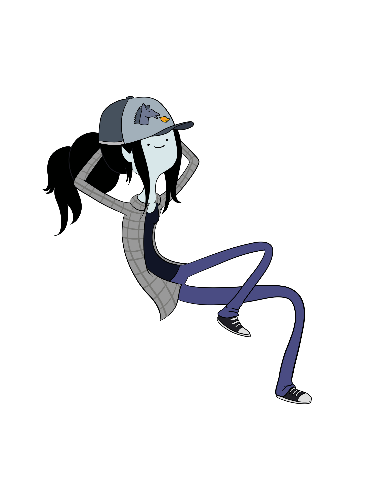

  <!-- 🌟 HERO SECTION: ANIMATED GAMING WORKSTATION BANNER 🌟 -->
  

    

  <!-- 🪟 FROSTED GLASS IDENTITY CARD WITH REALISTIC SPECULAR BORDER 🪟 -->
  

    

  <!-- ⚡ LIVE ANIMATED TYPING SVG ⚡ -->
  

    

  <!-- 🌐 FROSTED GLASS CONNECT BADGES 🌐 -->
  
  
  
  
  

    

  <!-- 📊 LIVE STATS & VISITOR BADGES 📊 -->
  
  &nbsp;
  
  &nbsp;
  

---

### 👨‍💻 About Me

<table>
  <tr>
    <td width="72%" valign="top">
      

        🎓 <strong>B.Tech in Electronics &amp; Communication Engineering (2022–2026)</strong> 
        <em>Swami Vivekananda Institute of Science &amp; Technology (MAKAUT University)</em>
      

      

        💡 <code>Code 💻 ➔ Automate 🤖 ➔ Test ⚡ ➔ Deploy 🚀</code>
      

      <ul>
        <li>🛰️ <strong>V2X &amp; RF Systems Researcher</strong>: Designed adaptive smart antenna prototypes with <strong>Ansys HFSS</strong> beamforming algorithms to dynamically direct electromagnetic signals toward high-speed moving vehicles and eliminate interference.</li>
        <li>🤖 <strong>AI Automation Developer</strong>: Architecting modular conversational assistants, autonomous multi-agent pipelines, and automated workflows using <strong>OpenAI API</strong>, <strong>Google AI Studio</strong>, and <strong>n8n</strong>.</li>
        <li>⚡ <strong>Embedded Hardware &amp; IoT</strong>: Building smart sensor telemetry prototypes using <strong>Arduino</strong> microcontrollers, ultrasonic matrices, and wireless RF communication shields.</li>
        <li>🎨 <strong>UI/UX &amp; Web Developer</strong>: Prototyping WCAG-accessible digital design systems in <strong>Figma</strong> and deploying responsive web applications on <strong>Vercel</strong>.</li>
        <li>🎮 <strong>Passions</strong>: Video game mechanics analysis, tech photography, sketching, and following hardware breakthroughs.</li>
        <li>📫 <strong>Direct Inquiries</strong>: <a href="mailto:kumarsinghratnesh3@gmail.com"><code>kumarsinghratnesh3@gmail.com</code></a></li>
      </ul>
    </td>
    <td width="28%" align="center" valign="middle">
      <!-- 🎨 ABOUT ME MASCOT / GRAPHIC 🎨 -->
      
    </td>
  </tr>
</table>

---

<!-- 🛠️ ANIMATED SKILLS HEADER GIF 🛠️ -->

  

 

  <!-- Interactive Skill Icons Grid (skillicons.dev) -->
  

    
  

   

  <!-- Categorized Glass Badges -->
  

    
    
    
    
    
    
    
    
    
    
    
    
    
    
  

---

<!-- 🌌 PANORAMIC BANNER GRAPHIC DIVIDER 🌌 -->

  

 

### 🚀 Featured Engineering & AI Projects

<table>
  <tr>
    <td width="50%" valign="top">
      <h3 align="center">🛰️ Smart Antenna Prototype (V2X)</h3>
      
<em>V2X Communication Research • Nov 2025 – Jul 2026</em>

      <ul>
        <li>Engineered an adaptive smart antenna prototype optimized for wireless vehicle-to-everything (V2X) communication in dynamic, high-mobility conditions.</li>
        <li>Simulated and implemented dynamic <strong>beamforming algorithms</strong> using <strong>Ansys HFSS</strong> to steer electromagnetic signals towards moving nodes and suppress interference.</li>
      </ul>
      

        <code>Ansys HFSS</code> • <code>RF Beamforming</code> • <code>V2X Protocols</code> • <code>Signal Processing</code>
      

    </td>
    <td width="50%" valign="top">
      <h3 align="center">🤖 Modular AI Conversational Assistant</h3>
      
<em>Python API Assistant • Aug 2024 – Nov 2024</em>

      <ul>
        <li>Built an intelligent, modular AI conversational engine powered by Python scripting and external <strong>REST API integrations</strong>.</li>
        <li>Implemented resilient client-server message serialization, conversation state tracking, dynamic context prompting, and secure fallback mechanisms.</li>
      </ul>
      

        <code>Python</code> • <code>OpenAI API</code> • <code>Google AI Studio</code> • <code>REST APIs</code> • <code>n8n</code>
      

    </td>
  </tr>
  <tr>
    <td width="50%" valign="top">
      <h3 align="center">🚗 Smart IoT Parking System</h3>
      
<em>Hardware Telemetry Prototype • May 2024 – Jul 2024</em>

      <ul>
        <li>Designed and assembled a real-time smart parking telemetry system using <strong>Arduino microcontrollers</strong> and ultrasonic sensor matrices.</li>
        <li>Engineered polling algorithms with custom debounce logic and wireless RF/Wi-Fi shield modules to broadcast occupancy metrics live.</li>
      </ul>
      

        <code>Arduino</code> • <code>Ultrasonic Sensors</code> • <code>Embedded C</code> • <code>IoT Telemetry</code>
      

    </td>
    <td width="50%" valign="top">
      <h3 align="center">🎨 Interactive Portfolio & UI/UX Design System</h3>
      
<em>Web & Product Design • Jan 2024 – Apr 2024</em>

      <ul>
        <li>Prototyped end-to-end interactive wireframes and visual design components in <strong>Figma</strong> adhering to <strong>WCAG accessibility standards</strong>.</li>
        <li>Developed a lightning-fast, fully responsive personal portfolio using semantic HTML5, CSS3, and deployed with CI/CD on <strong>Vercel</strong>.</li>
      </ul>
      

        <code>Figma</code> • <code>HTML5 / CSS3</code> • <code>Responsive Design</code> • <code>Vercel</code>
      

    </td>
  </tr>
</table>

---

### 📊 GitHub Activity &amp; Dynamic Statistics

  <!-- 🪟 FROSTED GLASS STATS DASHBOARD CARD WITH PERCHED CORNER CAT 🪟 -->
  

    

  <!-- Dynamic Live GitHub Streak Stats Card (Auto-updating in real-time) -->
  

    

  <!-- Dynamic Tokyo-Night Activity Wave Graph -->
  

 

<!-- 🐍 ANIMATED CONTRIBUTION SNAKE GAME 🐍 -->

  <picture>
    <source media="(prefers-color-scheme: dark)" srcset="https://raw.githubusercontent.com/Ratnesh919/Ratnesh919/output/github-contribution-grid-snake-dark.svg">
    <source media="(prefers-color-scheme: light)" srcset="https://raw.githubusercontent.com/Ratnesh919/Ratnesh919/output/github-contribution-grid-snake.svg">
    
  </picture>

---

### 📜 Certifications & Achievements

- 🗺️ **GIS (Geographic Information Systems)**: 2-week intensive training on geospatial mapping, spatial data annotation, and data tagging.
- 🐍 **Python Programming**: 1-month professional certification covering algorithms, automation pipelines, and core scripting.
- ⚙️ **C Language Programming**: 1-month certification focusing on advanced pointers, memory diagnostics, and data structures.
- 🔋 **Electric Vehicle (EV) Service Technician**: 1-month program on EV electronics, system diagnostics, and hardware testing.
- 📡 **Technical Workshops**: Active participant in university workshops on HAM Radio signal monitoring, BSNL telecom infrastructure, and Cybersecurity awareness.

---

### 🎓 Education & Background

- 🏛️ **B.Tech in Electronics & Communication Engineering** — *Swami Vivekananda Institute of Science & Technology (MAKAUT)* `[2022 – 2026]`
- 🏫 **12th Standard - Science (PCM)** — *P.B.S College, Bihar (B.S.E.B)* `[2018 – 2020]`
- 🎒 **10th Standard - Science** — *Vidyanjali High School (I.G.C.S.E)* `[2017 – 2018]`

---

### 💬 Let's Connect & Collaborate!

  
I'm always excited to discuss <strong>Networking Systems</strong>, <strong>AI Agents & Automation</strong>, <strong>IoT Hardware</strong>, or new project collaborations!

  <!-- Animated Social Icons -->
  

    
    
  

  
  &nbsp;&nbsp;
  
  &nbsp;&nbsp;
  
  &nbsp;&nbsp;
  

    

  <!-- Wave Footer -->
  

